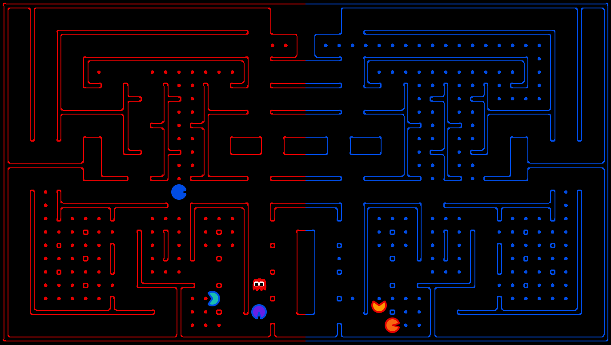

# Implementation of Agent Strategies in PacMan Capture The Flag

**Authors:** Enrique Favila, Marcelo Jimenez  
**Date:** 2024

---

This project is a submission for the Pacman Capture the Flag contest, originally created by UC Berkeley as part of their CS188 Artificial Intelligence course. The contest challenges participants to design intelligent agents that compete in a team-based, capture-the-flag variant of Pacman, where agents must balance offensive and defensive strategies. The codebase and contest framework are adapted from the official UC Berkeley Pacman AI projects, and this submission implements custom agent strategies using A* search for both offensive and defensive roles.

https://pacman-contest.upf.edu/final_UL_24-25/results_0.html 

Our implementation ranked 10th out of 63 contestants in the final round.

## PacMan Capture the Flag - Offensive and Defensive Agents

A breakdown of the agent behaviors using A*.

---

## Offensive A* Agent Strategy

The `OffensiveAStarAgent` class controls a Pacman agent using the A* search algorithm to make decisions and navigate the maze efficiently, maximizing rewards while considering various factors.

### 1. Initial Setup

- The agent registers its initial position at the start of the game.
- Inherits from `CaptureAgent`, the base class for agents in Pacman Capture the Flag.

### 2. Goal Selection

The `select_goal` method determines the agent's next goal based on these priorities:

- **Return home:** If no food is available, return to the starting position.
- **Pursue scared ghosts:** If in Pacman mode and scared ghosts are present, target the closest one.
- **Avoid enemies:** If enemies are too close, seek a capsule or return home if no capsules are available.
- **Return home if carrying food:** If carrying 5 pieces of food, return to base to avoid losing them.
- **Collect food:** Otherwise, target the nearest food.

### 3. Heuristic for Pathfinding

The agent uses A* search to find a path to its selected goal. The `calculate_heuristic` method includes:

- **Manhattan Distance:** Measures distance from the current position to the goal.
- **Enemy Penalty:** Adds a penalty when enemies are close, discouraging risky routes.

### 4. A* Search

The `a_star_search` method finds the optimal path from the agent's current position to its goal:

- **Legal Actions:** Only considers moves allowed by the game's rules.
- **Fallback Plan:** If no valid path to the goal is found, attempts to return home.

### 5. Movement

After determining the goal and best path, the agent selects the first action from the path. If no valid path is found, it tries to move toward its home position.

#### Summary

The `OffensiveAStarAgent` navigates the maze, prioritizes safe and strategic goals (avoiding enemies, targeting scared ghosts, collecting food), and uses A* search to find optimal paths. Its behavior focuses on efficient food collection while considering enemy proximity and power-ups.

---

## Defensive A* Agent Strategy

The `DefensiveAStarAgent` class is designed to defend the team's territory using the A* search algorithm to navigate and achieve specific goals based on the current game state.

### 1. Initial Setup

- Initializes its position, patrol point, and red team status at the start of the game.

### 2. Goal Selection

The `select_goal` method determines the agent's next goal based on these priorities:

- **If scared, go hide:** If the defensive ghost is scared, it tries to avoid the enemy Pacman.
- **If enemy invader, chase it:** If an enemy Pacman is detected in its territory, the agent chases it to force it back to base.
- **Patrol to midpoint:** Otherwise, the agent patrols the midpoint of its territory to intercept invaders efficiently.

### 3. Patrol Point Selection

The `find_valid_patrol_point` method dynamically determines a valid patrol point along the middle boundary, ensuring it's not blocked by walls.

### 4. Heuristic Calculation

The `calculate_heuristic` method computes a simple heuristic based on the maze distance between the current and goal positions.

### 5. A* Search

The `a_star_search` method implements A* to find the optimal path to the goal:

- **Legal Actions:** Only considers legal actions available in the game state.
- **Cost:** Calculates and compares movement costs to determine the shortest path.

### 6. Action Selection

The `choose_action` method computes the path using A* and takes the first action. If no path is found, the agent stops.

#### Summary

The `DefensiveAStarAgent` prioritizes:

- **Scared Ghost:** Return to the start position.
- **Invader:** Chase the closest invader.
- **Patrol:** Move toward the patrol point if there are no immediate threats.

The agent uses A* search to efficiently reach these goals while considering obstacles and enemies.

---